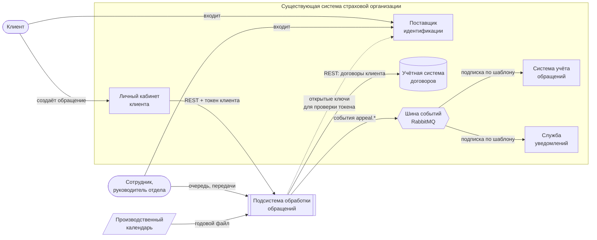

# Контракт интеграции подсистемы

С кем подсистема обработки обращений взаимодействует и на каких условиях. Форма
синхронных вызовов описана в [contracts-api.yaml](contracts-api.yaml); здесь — смысл
полей, требования к токену, каталог событий и гарантии. Решения, на которых держится
контракт, — в [decisions.md](decisions.md), номера указаны в скобках.

---

## Диаграмма контекста



Подсистема владеет только обработкой обращения: приёмом, привязкой к договору,
маршрутизацией, сроками, передачей между отделами и журналом. Всё остальное — внешние
системы (решения 15, 17). Рабочее место сотрудника входит в подсистему: очередь отдела,
сроки и передачи — её предметная область. Личный кабинет клиента — нет: это отдельный
продукт страховой, который вызывает API подсистемы.

В стенде внешние системы замещены эмуляторами (решение 19):

| Внешняя система | В стенде |
|---|---|
| Поставщик идентификации | Keycloak |
| Учётная система договоров | WireMock по `contracts-api.yaml` |
| Личный кабинет клиента | демонстрационный экран клиента |
| Система учёта обращений | очередь-подписчик на `appeal.#` |
| Служба уведомлений | не эмулируется, события публикуются |
| Производственный календарь | импорт файла в таблицу |

---

## 1. Учётная система договоров

Синхронный REST, подсистема — клиент. Два вызова:

| Вызов | Когда | Сколько ждём |
|---|---|---|
| `GET /clients/{counterpartyId}/contracts` | клиент открывает раздел обращений | до 3 с, затем деградация |
| `GET /contracts/{contractId}` | регистрация обращения, фоновая до-привязка | фоновый путь — с повторами (решение 10) |

### Смысл полей договора

| Поле | Смысл |
|---|---|
| `counterpartyId` | владелец договора; тот же идентификатор, что в токене клиента |
| `policyNumber` | номер полиса в том виде, в каком его видит клиент |
| `product.code` | продукт: `CASCO`, `OSAGO`, `MORTGAGE`, `PROPERTY`, `LIFE`. Разрез аналитики (решение 23) и выбор допустимых типов обращения (решение 24) |
| `validFrom`, `validTo` | период страхования, обе даты включительно |
| `terminatedOn` | дата досрочного прекращения: с этого дня договор не действует |
| `status` | состояние **на сегодня**, только для показа |

**Покрытие на дату события.** Договор покрывает дату `D`, если
`validFrom ≤ D ≤ validTo` и при этом `terminatedOn` отсутствует или `D < terminatedOn`.
Проверка покрытия (решение 21) опирается на даты, а не на `status`: статус описывает
сегодняшний день, а страховой случай мог произойти раньше. Договор, сегодня имеющий
статус `EXPIRED`, вполне мог покрывать событие прошлого месяца.

**Обращение можно создать по договору в любом статусе.** Клиент вправе написать и по
истёкшему договору — например, о возврате переплаты.

### Ответы и ошибки

| Ответ | Как трактует подсистема | Повтор |
|---|---|---|
| `200` | данные договора | — |
| `404` | договора нет или он не принадлежит клиенту; регистрация с ним отклоняется | нет — результат не изменится |
| `5xx`, таймаут | сбой учётной системы | да, по политике пути; при неудаче — деградированный режим (решения 9–11) |

### Снимок в обращении

Учётная система — источник правды о договоре, но обращение хранит **снимок** его полей на
момент регистрации: номер полиса, продукт, объект, период, дату прекращения. Обращение
фиксирует, каким договор был, когда клиент писал, и не меняется задним числом (решение 19).

### Доступ

Подсистема обращается к учётной системе под сервисной учётной записью (OAuth2 client
credentials, право `contracts.read`). В стенде не проверяется.

---

## 2. Поставщик идентификации

Подсистема никого не аутентифицирует (решение 22). Она работает как OAuth2 Resource
Server: принимает токен из заголовка `Authorization: Bearer`, проверяет подпись по
открытым ключам IdP, издателя, аудиторию и срок.

### Требования к токену

| Поле | У кого | Смысл |
|---|---|---|
| `iss` | все | издатель — IdP страховой организации |
| `aud` | все | содержит `insurance-appeals` |
| `exp` | все | срок действия |
| `sub` | все | идентификатор пользователя в IdP |
| `roles` | все | `CLIENT`, `SPECIALIST`, `SUPERVISOR`, `ADMIN` |
| `counterparty_id` | клиенты | идентификатор контрагента в учётной системе |
| `department` | сотрудники | код подразделения, например `CLAIMS` |

**Идентификатор клиента берётся только из `counterparty_id`, никогда из запроса.**
Подставить чужой идентификатор в запрос нельзя — его там нет.

Поле называется `counterparty_id`, а не `client_id`: в OAuth `client_id` уже означает
приложение, получившее токен, и совпадение имён привело бы к путанице.

**Сопоставление идентификаторов — ответственность страховой.** Идентификатор
пользователя в IdP и идентификатор контрагента в учётной системе могут различаться;
как `counterparty_id` попадает в токен, решает страховая организация.

---

## 3. События подсистемы

Подсистема публикует факты о жизни обращения в обменник `appeal.events` (тип topic,
устойчивый). О потребителях она не знает: каждый объявляет свою очередь и привязывает её
к обменнику своим шаблоном (решение 1).

### Конверт

| Поле | Смысл |
|---|---|
| `eventId` | уникальный идентификатор события — ключ дедупликации для потребителя |
| `eventType` | тип события, например `APPEAL_ROUTED` |
| `appealId` | идентификатор обращения |
| `routingKey` | ключ маршрутизации, с которым событие опубликовано |
| `details` | атрибуты события, строковые пары ключ — значение |
| `occurredAt` | момент события, UTC |

### Каталог

| `eventType` | Ключ маршрутизации | Когда | `details` |
|---|---|---|---|
| `APPEAL_CREATED` | `appeal.created.<категория>.<тип>` | обращение зарегистрировано | `category`, `subcategory`, `publicNumber` |
| `APPEAL_ROUTED` | `appeal.routed.<отдел>` | назначен отдел и срок | `departmentCode`, `subcategory`, `priority`, `slaHours` |
| `APPEAL_STATUS_CHANGED` | `appeal.status.<статус>` | сменился статус | `fromStatus`, `toStatus` |
| `APPEAL_MESSAGE_ADDED` | `appeal.message.<автор>` | новое сообщение в переписке | `authorType` |
| `APPEAL_ATTACHMENTS_ADDED` | `appeal.attachment.added` | приложены файлы | `count` |
| `APPEAL_TRANSFER_REQUESTED` | `appeal.transfer.requested.<целевой отдел>` | запрошена передача | `fromDepartment`, `toDepartment`, `requestedBy` |
| `APPEAL_TRANSFER_APPROVED` | `appeal.transfer.approved.<целевой отдел>` | передача согласована | `fromDepartment`, `toDepartment`, `reviewedBy` |
| `APPEAL_TRANSFER_REJECTED` | `appeal.transfer.rejected.<целевой отдел>` | передача отклонена | `fromDepartment`, `toDepartment`, `reviewedBy` |
| `APPEAL_SLA_BREACHING` | `appeal.sla.breaching.<отдел>` | срок истекает — **планируется** (решение 14) | `departmentCode`, `deadlineAt` |

Сегменты ключа — в нижнем регистре. Примеры подписок:

| Потребитель | Шаблоны |
|---|---|
| Система учёта обращений | `appeal.routed.#`, `appeal.status.#`, `appeal.transfer.approved.#` |
| Служба уведомлений | `appeal.status.#`, `appeal.message.employee` |
| Руководитель отдела убытков | `appeal.sla.breaching.claims`, `appeal.transfer.requested.claims` |

### Гарантии

- **Доставка at-least-once.** Событие может прийти повторно; потребитель обязан
  дедуплицировать по `eventId` (решения 3, 4).
- **Порядок не гарантирован.** Актуальное состояние обращения потребитель берёт из API
  подсистемы по `appealId`, а не восстанавливает по последовательности событий.
- **В событиях нет персональных данных клиента** — только идентификаторы и коды.
  Подробности потребитель запрашивает у API с собственными правами доступа.
- **Изменения только добавляющие:** новые поля в `details`, новые типы событий. Удаление
  поля или смена его смысла — это новый `eventType`, старый публикуется до отказа
  потребителей от него.

---

## 4. Производственный календарь

Не живая система, а справочные данные (решение 13). Раз в год загружается файл
утверждённого производственного календаря:

```
date,kind
2027-01-01,HOLIDAY
2027-01-09,WEEKEND
2027-02-22,WORKDAY
```

`kind`: `WORKDAY` — рабочий, `WEEKEND` — выходной, `HOLIDAY` — праздничный. Дни, не
перечисленные в файле, считаются по обычной неделе: понедельник — пятница рабочие.

---

## 5. Личный кабинет клиента

Вызывает API подсистемы с токеном клиента. Форму обращения строит по схеме, которую
отдаёт подсистема: допустимые для продукта договора типы и обязательные поля
(решение 24). В стенде роль кабинета играет демонстрационный экран клиента.

---

## Отклонения текущей реализации от контракта

Контракт описывает целевое состояние. Сейчас прототип расходится с ним в следующем — это
и есть работа ближайших блоков:

| Отклонение | Чем устраняется |
|---|---|
| Договоры и клиенты хранятся в таблицах подсистемы | заглушка учётной системы и снимок договора в обращении |
| Продукт договора — строка `insurance_type` («КАСКО»), а не код | переход на `product.code` вместе с заглушкой |
| Нет даты досрочного прекращения — проверка покрытия невозможна | поле `terminatedOn` в снимке |
| Идентификатор клиента приходит в теле запроса | вход через IdP, `counterparty_id` из токена |
| События передачи содержат ФИО сотрудника (`requestedBy`, `reviewedBy`) — это персональные данные | заменить идентификатором сотрудника |
